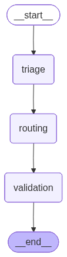

# E-Commerce AI Customer Support Agent

<div align="center">
  
  
  
  
  
</div>

---

An AI-powered customer support system using a dynamic multi-agent workflow.

Built with LangGraph, FastAPI, and React for real-time, specialized support responses.

---

## Overview

This project implements a manager-style multi-agent architecture:

**Triage -> Dynamic Execution -> Supervisor -> (Retry or End)**

- **Triage Agent** classifies user intent.
- **Router Agent** chooses which specialists to call.
- **Specialist Agents** produce domain-specific responses.
- **Supervisor Agent** validates quality and can request retries.
- **FastAPI SSE** streams responses token-by-token to the frontend.

---

## Key Features

- Dynamic multi-agent orchestration with conditional retry loop
- Specialist agents: context, support, sales, billing, refund, general
- Supervisor approval/retry format for quality control
- Real-time SSE streaming (`meta`, `chunk`, `done`, `error`)
- Frontend agent manifest panel from backend (`/api/agents`)
- Glassmorphism dark UI with live agent highlighting

---

## Tech Stack

| Layer | Technology |
|-------|------------|
| **Orchestration** | LangGraph |
| **Backend** | FastAPI, Python |
| **Frontend** | React 18, Vite |
| **Styling** | Tailwind CSS, custom glassmorphism theme |
| **Icons** | Lucide React |
| **LLM Provider** | Groq (Llama 3.3) |

---

## Architecture

```text
User Query
    |
    v
Triage Node
    |
    v
Dynamic Execution Node (Router + Specialists)
    |
    v
Supervisor Node
    |--------------------|
    | needs_retry = true |--> back to Dynamic Execution
    |--------------------|
             |
             v
            END
```

### Workflow Graph


---

## Project Structure

```text
Customer_Support_Respresentative/
├── backend/
│   ├── graphs/
│   │   ├── generate_graph.py
│   │   └── agent_graph.png
│   └── src/
│       └── api/
│           ├── main.py                    # FastAPI app + endpoints + graph wiring
│           ├── nodes/
│           │   └── agent_nodes.py         # Triaging, routing, execution, supervisor logic
│           └── api/
│               ├── config.py              # Model, RunConfig, env validation
│               ├── triage_agent.py
│               ├── router_agent.py
│               ├── context_agent.py
│               ├── support_agent.py
│               ├── sales_agent.py
│               ├── billing_agent.py
│               ├── refund_agent.py
│               ├── general_agent.py
│               ├── supervisor_agent.py
│               └── validator.py           # legacy/optional validator node
├── frontend/
│   ├── src/
│   │   ├── App.jsx
│   │   ├── index.css
│   │   ├── services/
│   │   │   └── api.js                     # API base URL + manifest fetch
│   │   ├── utils/
│   │   │   └── sseChat.js                 # SSE stream lifecycle handling
│   │   └── components/
│   │       ├── AgentSidebar.jsx
│   │       ├── AgentStatus.jsx
│   │       ├── ChatWindow.jsx
│   │       ├── MessageBubble.jsx
│   │       ├── InputBox.jsx
│   │       └── ui/
│   │           ├── button.jsx
│   │           └── input.jsx
├── .env.example
├── .env
└── requirements.txt
```

---

## Installation

### Prerequisites

- Python 3.9+ (recommended: 3.11/3.12)
- Node.js 18+
- Groq API key

### Backend Setup

```bash
# From project root
python -m venv .venv

# Windows
.venv\Scripts\activate

# macOS/Linux
source .venv/bin/activate

pip install -r requirements.txt
```

### Frontend Setup

```bash
cd frontend
npm install
```

---

## Environment Setup

Copy `.env.example` to `.env` and set values:

```env
GROQ_API_KEY=your_groq_api_key_here
GROQ_BASE_URL=https://api.groq.com/openai/v1
ALLOWED_ORIGINS=http://localhost:5173
MAX_OUTPUT_TOKENS=128
```

Frontend optional env (`frontend/.env`):

```env
VITE_API_URL=http://127.0.0.1:8000
```

---

## How to Run

### Start Backend

```bash
python -m uvicorn backend.src.api.main:app --reload
```

Backend: `http://127.0.0.1:8000`

### Start Frontend

```bash
cd frontend
npm run dev
```

Frontend: `http://localhost:5173`

---

## API Endpoints

| Method | Endpoint | Description |
|--------|----------|-------------|
| `GET` | `/api/agents` | Agent manifest (name, role, description) for frontend sidebar |
| `POST` | `/api/query` | Non-streaming response with category |
| `GET` | `/api/stream?query=<text>` | SSE streaming response (`meta/chunk/done/error`) |

### Example Request

```bash
curl -X POST http://localhost:8000/api/query \
  -H "Content-Type: application/json" \
  -d "{\"query\":\"I need a refund for order #12345\"}"
```

---

## Agents

| Agent | Purpose |
|-------|---------|
| **Triage** | Classifies incoming query category |
| **Router** | Selects specialist agents dynamically |
| **Context** | Summarizes prior context for better responses |
| **Support** | Handles complaints and service issues |
| **Sales** | Handles product and purchase questions |
| **Billing** | Handles payments and invoice questions |
| **Refund** | Handles refund requests and refund policy |
| **General** | Fallback for broad/general support |
| **Supervisor** | Approves final response or triggers retry |

---

## Generate Workflow Diagram

From project root:

```bash
python -m backend.graphs.generate_graph
```

---

## Future Improvements

- [ ] Authentication and protected endpoints
- [ ] Persistent conversation memory/database
- [ ] Domain tool integrations (orders, invoices, shipping APIs)
- [ ] Automated backend/frontend integration tests
- [ ] WebSocket streaming support for richer bi-directional UX

---

## License

MIT License

---

*Built by Syed Sarim Abbas*
